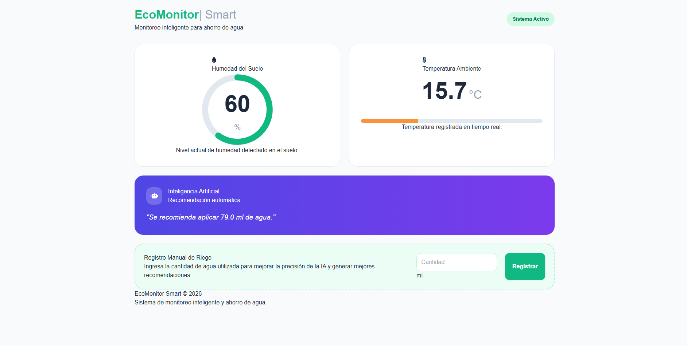

## Características
- **IA Predictiva:** Utiliza un modelo de Regresión (Scikit-learn) entrenado para minimizar el gasto de agua.
- **Data Integrada:** Conexión con la API de OpenWeatherMap para obtener condiciones climáticas reales.
- **Dashboard en Tiempo Real:** Interfaz web moderna construida con Tailwind CSS y JavaScript.
- **Arquitectura Híbrida:** Capaz de recibir datos vía Serial (USB) de microcontroladores como ATtiny85/Arduino.

---

## Requisitos Previos
- **Python 3.10+**
- **Hardware:** Sensor de humedad de suelo + Microcontrolador (puerto serial).
- **API Key:** Una cuenta en [OpenWeatherMap](https://openweathermap.org/) para obtener el clima.

---

## Instalación

1. **Clonar o descargar el proyecto:**
   ```bash
   git clone <url-del-repositorio>
   cd Water-saving-module-main
   ```

2. **Crear y activar entorno virtual:**
   ```bash
   python -m venv .venv
   # En Windows:
   .\.venv\Scripts\activate
   # En Linux/Mac/Raspberry Pi:
   source .venv/bin/activate
   ```

3. **Instalar dependencias:**
   ```bash
   pip install -r requirements.txt
   ```

---

## Entrenamiento de la IA
Antes de iniciar el sistema por primera vez, debes generar el "cerebro" del proyecto:
1. Genera datos de prueba (si no tienes datos reales aún): `python generador_datos.py`
2. Entrena el modelo: `python ia_training.py`
   *Esto generará el archivo `modeloIA_riego.pkl`.*

---

## Guía de Uso

El sistema requiere que tres componentes funcionen en paralelo:

### 1. Iniciar el Servidor (Backend)
```bash
uvicorn main:app --reload
```
*La API estará disponible en `http://127.0.0.1:8000`.*

### 2. Conectar el Sensor (Puente Serial)
Asegúrate de que el sensor esté conectado al puerto USB y edita el puerto en `puente_serial.py` (ej: `COM3` o `/dev/ttyUSB0`).
```bash
python puente_serial.py
```

### 3. Abrir el Dashboard (Frontend)
Simplemente abre el archivo `index.html` en tu navegador favorito.

---

## Estructura de Archivos
- `main.py`: Servidor FastAPI, lógica de la IA y gestión de historial.
- `puente_serial.py`: Script traductor entre el sensor físico y la API.
- `index.html`: Dashboard visual del usuario.
- `ia_training.py`: Código para entrenar el modelo de Machine Learning.
- `historial_riego.csv`: Base de datos local en formato CSV.

---

## Configuración (main.py)
Recuerda cambiar estas variables en el código:
- `API_KEY`: Tu llave de OpenWeatherMap.
- `Ciudad`: Tu ciudad actual (ej: "Santiago,CL").

---

## Arquitectura

- `wsm.ino`: firmware que se carga en el microcontrolador conectado al sensor de humedad (actúa como transmisor de los datos).
- `wsm_reciver.ino`: firmware del microcontrolador receptor, que recibe esos datos y los reenvía al puente serial (`puente_serial.py`).

## Dashboard

